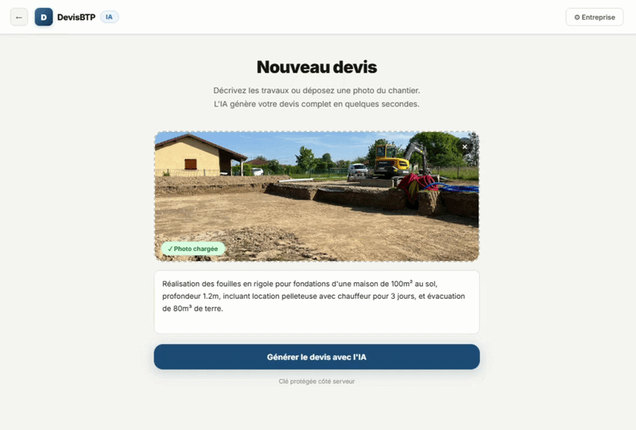
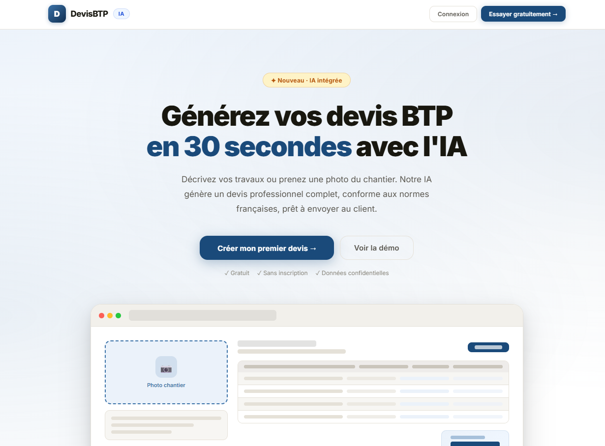
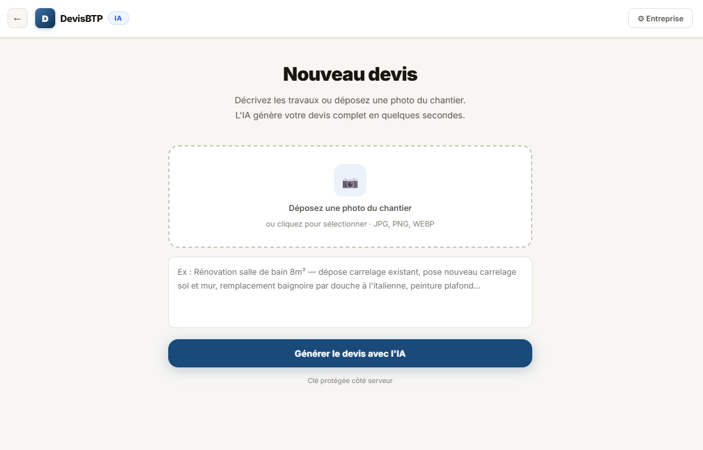
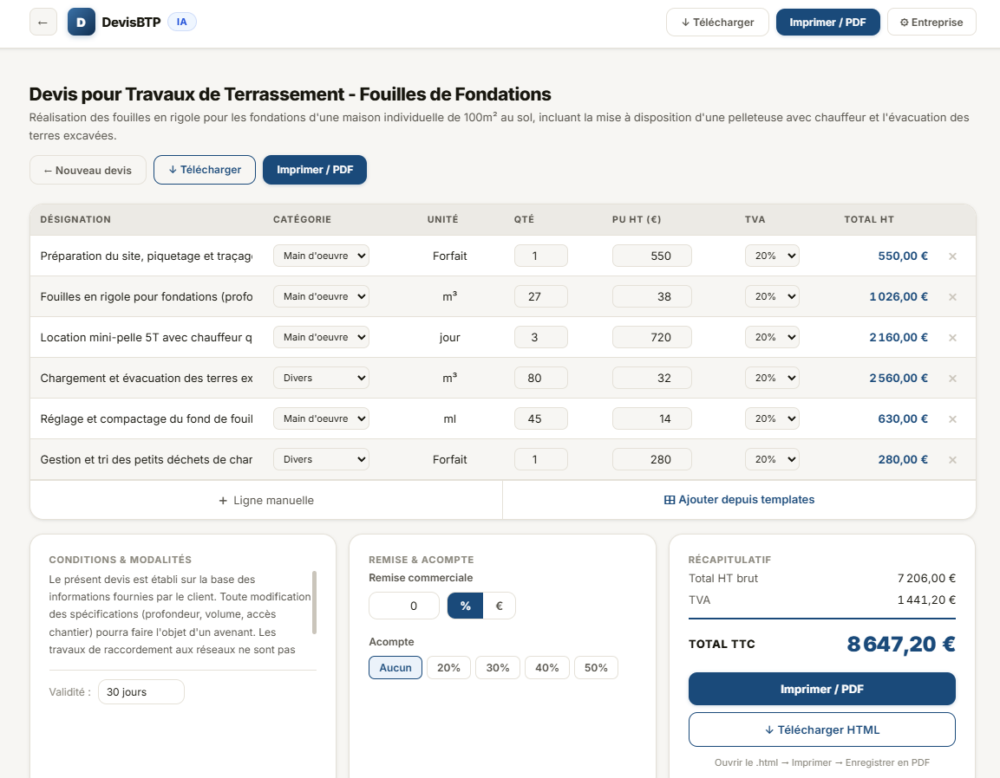
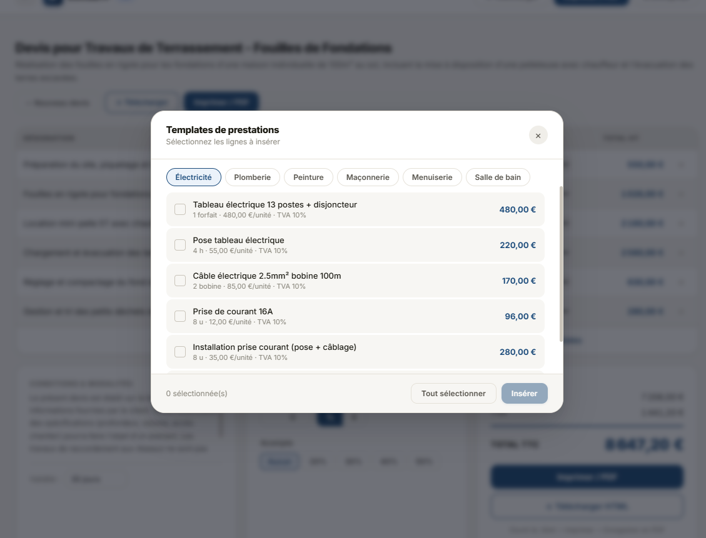

# Devis BTP

Application web React pour aider les artisans et entreprises du BTP à générer rapidement des devis professionnels à partir d'une description de travaux ou d'une photo de chantier.



## Objectif

Ce projet montre une interface complète pour préparer, ajuster et exporter un devis BTP. Il s'adresse aux entreprises de bâtiment, artisans, conducteurs de travaux et profils techniques qui veulent gagner du temps sur la préparation commerciale.

L'application permet de :

- générer une base de devis avec l'IA à partir d'une description ou d'une image ;
- modifier les lignes de devis : désignation, catégorie, quantité, prix HT et TVA ;
- appliquer une remise commerciale et un acompte ;
- renseigner les informations entreprise et client ;
- imprimer le devis ou l'enregistrer en PDF ;
- utiliser des modèles de prestations BTP : électricité, plomberie, peinture, maçonnerie, menuiserie et salle de bain.

## Exemple PDF

Un exemple de rendu PDF est disponible ici :

[Ouvrir l'exemple de devis BTP](assets/documents/exemple-devis-btp.pdf)

## Aperçu

### Accueil



### Génération du devis



### Edition du devis



### Export PDF



## Technologies

- React
- Create React App
- Node.js
- API serverless compatible Vercel
- Génération assistée par IA via un backend sécurisé

## Lancer le projet

Installer les dépendances :

```bash
npm install
```

Lancer l'application en développement :

```bash
npm run dev
```

Lancer uniquement le frontend :

```bash
npm start
```

Créer une version de production :

```bash
npm run build
```

## Configuration

Créer un fichier `.env` à la racine du projet avec la clé API utilisée par le backend :

```env
GEMINI_API_KEY=votre_cle_api
```

La clé reste côté serveur et n'est pas exposée dans le navigateur.

## Pourquoi ce projet

J'ai développé Devis BTP pour démontrer une capacité à construire un outil métier concret : interface claire, logique de calcul, génération de documents, export PDF et intégration IA côté serveur.

Ce projet peut intéresser :

- une entreprise BTP qui veut digitaliser la préparation de devis ;
- un recruteur qui cherche un profil capable de transformer un besoin métier en produit utilisable ;
- un artisan ou une PME qui veut tester un prototype de génération de devis.

## Profil

Projet réalisé par Idris.

Je suis intéressé par les projets web, les outils métiers et les solutions numériques pour les entreprises du BTP. Ce dépôt sert de démonstration technique et produit pour présenter mon travail.
